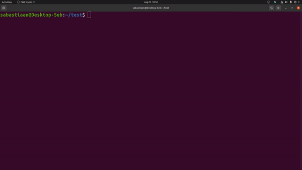

# Essence

This project aims to generate stand-alone executables for functions residing in llvm bitcode modules.
Functions can be specified by name and convenient JSON input templates will be generated in which their arguments (including globals) can be specified.
The project is sub-divided into two components: `essence` is the python tool which is meant for users and handles all of the end-to-end functionality, and `handsanitizer` which is the c++ component that interacts directly with the LLVM bitcode modules and generates neccesary code/templates.



### Features:
The project currently supports:
* Listing all function signatures inside an llvm bitcode module sorted by purity
* Generating executables for a specified list of functions
  * Easy JSON in/output. 
  abstracts memory away allowing the user to specify values directly underneath the pointers as well as directly past it. 
  * Generates minimal templates, global variables not touched by the function are not included 
* Supports aggregate types `arrays`, `structs` and `unions`
* Supports circular pointer type definitions, i.e `struct X { struct X* x};`
* Supports functions calling other functions 


It does _not_ support:
* Purity discovery, meaning that if your program is compiled with -O0 all functions will be listed as impure
* Bitcode modules containing one of the following LLVM types `Function`,`Vector` `x86amx`, or `x86_mmx`
* Functions that use `stdin`/`stdout`


## Install instructions

```shell
$ sudo apt install llvm-11 llvm-11-tools
$ git clone https://github.com/trailofbits/essence
$ cd essence
$ cmake CMakeLists.txt
$ make 
$ pip install -e ./
```
Or as a one-liner
```shell
git clone https://github.com/trailofbits/essence && cd essence && cmake CMakeLists.txt && make && pip install -e ./
```


it is required to specify the `-e` flag as otherwise pathing between `essence` and `handsanitizer` will break.


## Commands
#### `essence <input.bc>`
This command lists the functions in a bitcode file, together with their signature and purity level


#### `essence --build [--output/-o outputdir] [--no-template] <input.bc> <list_of_function_names>`
This command will build an executable for f1 and f2.
The output directory can be specified, as well as that the JSON input template should not be (re)generated to preserve arguments inside the template file.


#### `essence --build-read-none <input.bc>`
Build all functions inside input.bc that are of purity level `read-none`

#### `essence --build-write-only <input.bc>`
Build all functions inside input.bc that are of purity level `write-only`

### About purity
Our focus is primarily "pure" functions. There are two major categories of pure functions

1. `read none`:
   This category returns the same value for the same input every no matter how often the function is called.
   Additionally, a `read none` functions are not allowed to have side-effects and hence are not allowed to touch memory at all.

2. `write only`: These functions are similar to `read none` with the exception that these _are_ allowed to _write_ to memory. Since they are not allowed to read from memory the behavior should still be identical for every identical input, but this class can save for instance the return values to a global variable


This project aims to do the following to extract all pure functions from an llvm bitcode file, and emit a separate executable for each.
Every executable is accompanied by a json file specifiying it's arguments which can be given as a direct argument to the binary.

mvp example 

```c
llvm containing bitcode for: 
int f(int x, int y){ return x + y}
~~~~
ouput/
    - f.cpp
    - f.json
    - f

~~~~ call function with
./f f.json
```


### Pointers
For pointers we do the following:
1. If a function does accept a pointer, either directly or indirectly as a struct member,
   we expose a setter to the _underlying_ value, regardless of how many levels of indirections there are.

2. To allow for C style strings, we also allow for the specification of what memory should look like directly behind the value


Example 1: Setting the underlying value
```
void f(int* x);
int x = parser.get<int>("--x"); // set the underlying value
f(&x);
```

Example 2: Multiple levels of indirection exist
```
f(char*** z);
char u = parser.get<char>("--z");
char x = &u;
char** y = &x;
char*** z = &y; 
f(z); // or f(&y);
```

Example 3: Strings
```
f(char* x);
----
int x_arraysize = json_input["--x"].size();
int x_buffer = malloc(sizeof(char) * x_arraysize);
for(int i =0; i < x_array_size; i++)
    x_buffer[i] = json_input["--x"][i]; 
```

Later on we might include support aliasing, but this feature is currently considered out of scope. An example might be following scenario:
```
f(int** x, int *y);
./handsanitzer --x=3 y=--x

int* x2 = &parser.get<char>("--x");
int** x1 = &x2;
int* y = x2;
f(x1, y);
```


